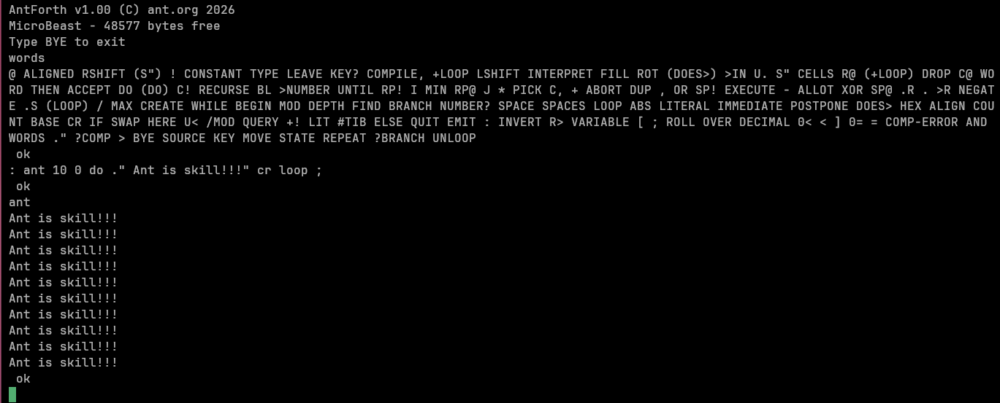
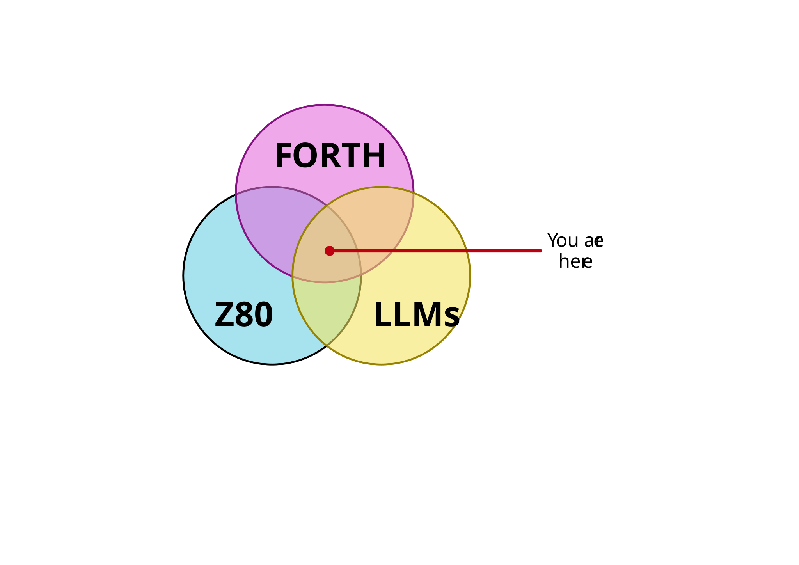
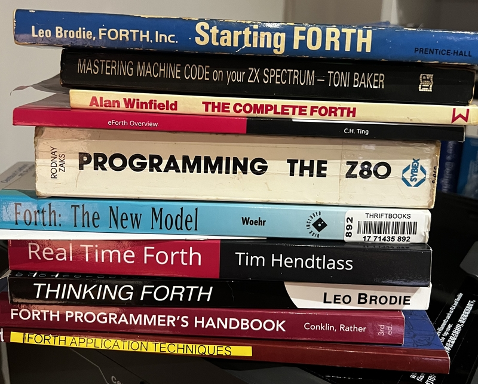

# AntForth

A modern Forth for the [Feersum Technology MicroBeast](https://feersumbeasts.com/microbeast.html).

(And by "modern" I means ANS Forth standard circa 1997!)

Here's it running on the target hardware:

## Version 3.0.6

The 1.x series releases were a bit bare-bones; 2.0 added a full Z80
assembler, custom wordlists, and CP/M file support; 3.0.1 brought
banked-memory support — the user-facing `BANK*` wordset that lets
antforth address the MicroBeast's full 512 KB of RAM via the MMU
portal at `$8000-$BFFF`. 3.0.2 completes the 12-word `BANK*` wordset
with the descriptor-stub mechanism + cross-bank `EXIT` sentinel-
trampoline + `BANK-OF` (descriptor-stub byte-1 read) + `IN-BANK`
(kernel-blessed, CATCH-safe save/switch/EXECUTE/restore wrapper).
3.0.3 ships the verified bank-aware compiler mechanism: per-bank
`HERE`/`LATEST`/`,`/`COMPILE,`, bank-aware `:` with an automatic
descriptor-stub emitted on `;`, and bank-aware `CREATE`/`DOES>`.
(In 3.0.3 banked words still dispatched only via the explicit
`EXECUTE` path.) 3.0.4 delivers the cross-bank-dispatch stabilization
interlude (Epic 19.5): a self-dispatching `RST $28` descriptor-stub +
fixed-memory return thunk, portal-aliasing `BANK!` window guards, and
caught-`THROW` cross-bank state restore. The behavioural compiler-
transparent-banking north-star — calling a banked word from a
compiled definition *by name* — is now delivered on the emulator, and
the dispatch mechanism is confirmed on real MicroBeast silicon. (In
3.0.4 one portal-aliasing limit remained: bank-N words were not yet
`FIND`-able by name from another bank, contained by the `BANK!` guard
and carried to Epic 20.) 3.0.5 delivers the bank-aware lookup surface
(Epic 20): `FIND` now traverses every bank invisibly via 24-bit fat
dictionary pointers — a banked word resolves by name from any bank,
and the everyday FORTH-wordlist path incurs no MMU switch — while
`WORDS` produces a single unified flat listing spanning all banks.
3.0.6 delivers the bank-aware *lifecycle* surface (Epic 21):
`MARKER`/`FORGET` now snapshot and revert each active bank's
dictionary tail *and* the descriptor-stub allocator tail (a banked
word defined after a `FORGET` reuses the reclaimed stub slot rather
than leaking it); `QUIT` re-asserts the user's last interactive bank
on an `ABORT`/`THROW` unwind, so a crash never strands you in the
bank the aborted thread happened to be in; and an `INCLUDE`d file's
`BANK!` calls no longer pollute that saved-bank cell.

V3.0.6 supports the following ANS Forth standard words:

| § | Module | antforth | Coverage |
|---|--------|----------|----------|
| **6.1** | Core | 133 / 133 | **100%** |
| **6.2** | Core Extensions | 14 / 46 | ~30% |
| **7.6** | Block | 0 | 0% (deferred) |
| **8.6** | Double-Number | 13 / 14 | ~93% |
| **9.6** | Exception | 4 / 4 | **100%** |
| **10.6** | Facility | 1 / ~9 | ~10% |
| **11.6** | File-Access | 17 / 17 | **~95%** (FILE-STATUS missing) |
| **12.6** | Floating-Point | 0 | 0% (deferred) |
| **13.6** | Locals | 0 | 0% (deferred) |
| **14.6** | Memory-Allocation | 0 | 0% (deferred) |
| **15.6** | Programming-Tools | 2 / 5 | ~40% (.S, WORDS — no SEE/DUMP/?) |
| **16.6** | Search-Order | 6 / 6 | **100%** + ext |
| **17.6** | String | 1 / ~9 | low (MOVE only) |

In addition we have some words outside the standard:

| Word | Source | Origin / role |
|------|--------|---------------|
| `SP@` `SP!` `RP@` `RP!` | `stack_ops.asm` | fig-Forth-era stack-pointer access; common extension |
| `DPL` | `outer_interpreter.asm` | fig-Forth-era double-precision parse state |
| `NUMBER?` | `outer_interpreter.asm` | parsing helper |
| `CATCH-TOP` | `exception.asm` | antforth ext — exception-frame chain head (CCD-2) |
| `INCLUDE-TOP` | `exception.asm` | antforth ext — INCLUDE source-frame chain head (CCD-1) |
| `HLD` | `pictured.asm` | pictured-output cursor USER variable (de-facto Forth) |
| `0x` numeric prefix | parser | C-style hex literal — antforth ext alongside Forth 2014 `$` / `#` / `%` |

And a whopping 81 words in the assembler, which are a mix of opcode mnemonics with trailing comma 
(`LD,` `ADD,` `JP,` `CALL,` `RET,` `INC,` `DEC,` `RLC,` etc.), structural words (`CODE` / `END-CODE`, `LABEL` / `FIX`), 
pseudo-ops (`DB`, `DW`, `DS`, `EQU`), addressing-mode helpers (`()`, `#`, `+D`), and stack/flow 
primitives (`PUSH`, `POP`, `JR`, `NEXT,`).

> **Banking note — define `CODE` words from bank 0.** `CODE` words are intended to live in
> fixed (unbanked) memory, where — like the kernel primitives — they stay callable from every
> bank. Defining a `CODE` word while another bank is mapped is not a supported configuration yet.
> In-bank CODE words are a planned future-phase capability: the assembler in a CODE word only
> ever branches within its own body or calls BIOS / fixed-memory routines (both always mapped),
> so a future phase can host CODE bodies in banks via the descriptor-stub mechanism, with the
> single rule "no absolute jump into another bank's body."

## Banking

Each memory bank carries its own dictionary state (`HERE`, `LATEST`,
wordlist heads), swapped by `BANK!`. That makes addresses bank-relative: a
pointer captured in one bank is not valid after you switch to another. Before
you write your first multi-bank application, read
[Cross-bank pointer hazards](docs/banking-pointer-hazards.md) — it names the
bank-sensitive pointers, shows the anti-pattern to avoid, and covers the
cross-bank return-stack overflow gotcha.

Tip: enable the opt-in prompt indicator with `-1 PROMPT-SHOW-BANK` to show the
current bank as a `[N]` prefix on the `ok` prompt (off by default; suppressed
in bank 0).

## Coming up in the next version 

- Bank-aware compilation — cross-bank colon definitions transparent to the user (descriptor-stub mechanism; antforth 3.1+)
- Per-bank dictionary search-order traversal and `WORDS`
- Co-operative multi-tasking and event handlers
- Local variable support 

## Bluesky wishlist 

- VideoBeast / AudioBeast support
- Exception Extensions
- Floating Point wordset
- Turnkey compiler
- Object Oriented extensions (I have tracked down a copy of Dick Pountain's extremely rare book, but have yet to absorb it)
- non-Beastly targets

## Built by robots

If you're thinking "there's not much modern about a 56 year 
old language on a 50 year old processor" then [wait til you see 
how I implemented it](https://blowback.github.io/antforth/) using state-of-the-art agentic LLMs...

There's still plenty to do if you're the Human in the Loop tho:

