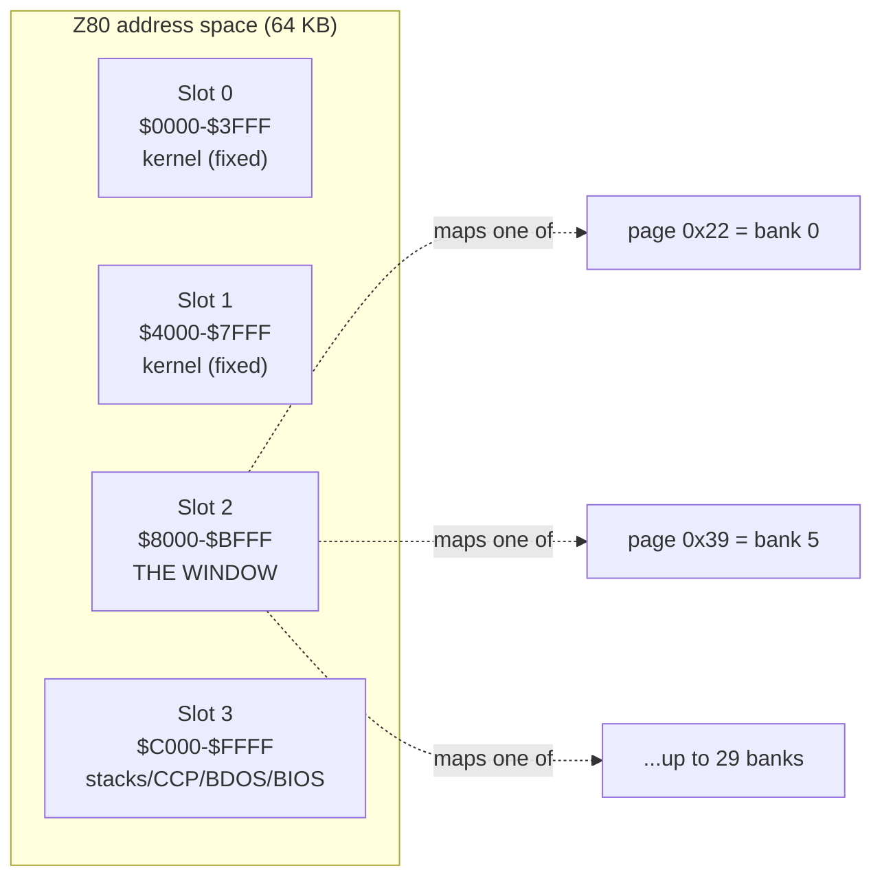
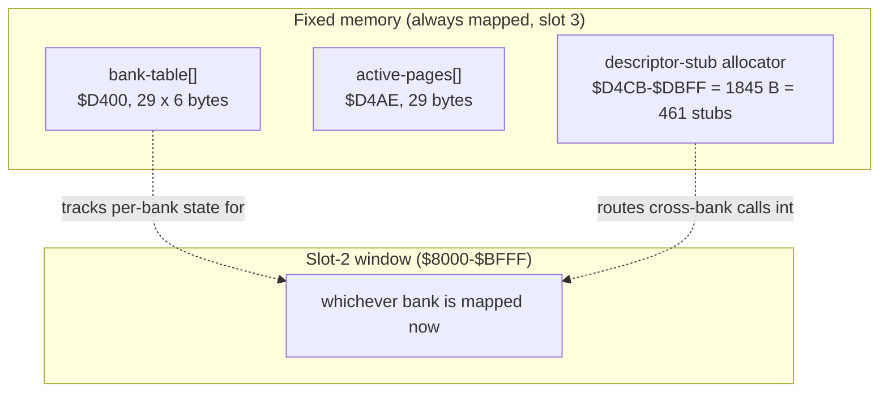
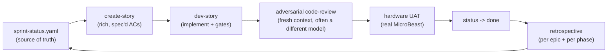
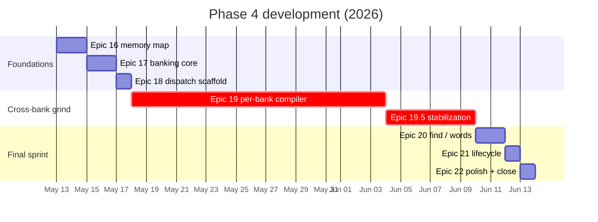

# Teaching a Z80 Forth to Use Half a Megabyte: antforth Phase 4

A Z80 can only see 64 KB at once. The MicroBeast retro computer has **512 KB** of RAM. Phase 4 of antforth — our CP/M-hosted Forth — was about closing that gap: letting a single Forth session compile words into, and call words across, banks of memory that don't all fit in the processor's address space at the same time.

This post is the story of that phase. It ships as **antforth v3.0.7**, the first *feature* release since v2.0. I'll lead with the architecture and the things that went wrong (there were a few good ones), and weave in how we used [BMAD](https://github.com/bmad-code-org/BMAD-METHOD) — an agentic, spec-driven development method — to orchestrate the whole thing without losing the thread.

If you write Forth or sling Z80, there are deeper sidebars for you. If you're here for the "how do you actually build something complex with AI agents" angle, the connective tissue is the BMAD loop, and you can skim the hex.

## The idea: a window, not a map

The naive way to use more memory is a flat map — every byte has one address. That's impossible here: 512 KB doesn't fit in 16 bits.

The MicroBeast's MMU solves this the classic 8-bit way. The Z80's 64 KB is divided into four **16 KB slots**. Each slot displays one **16 KB page** chosen from a 6-bit page space (64 pages × 16 KB = 1 MB of addressable pages, of which 512 KB is real RAM). Change a slot's page register and the *same Z80 addresses* now read and write different physical memory.



Three slots stay nailed down: the kernel lives in slots 0 and 1, and the stacks, the CP/M residency, BDOS and BIOS live in slot 3. **Slot 2 (`$8000–$BFFF`) is the window.** Banking is, fundamentally, the discipline of deciding *which page is in the window right now*, and making the Forth dictionary behave sanely as that page changes underneath it.

The default configuration gives you **12 banks** (192 KB). Sacrifice the virtual console and the RAM disk and you can push to a theoretical **29 banks** (464 KB) — all surfaced to the user through one word, `BANK!`.

```forth
5 BANK!        \ map page for bank 5 into the window
: GREET ." hi from bank 5" ;
0 BANK!        \ back to bank 0
GREET          \ still works — prints "hi from bank 5"
```

That last line is the whole problem in miniature. When you type `GREET` from bank 0, its *code* isn't mapped in. Something has to notice, swap bank 5 into the window, run it, and swap back — without the user ever knowing. How we got there is the rest of this story.

## The architecture: a portal, a triple, and a pile of stubs

### Reclaiming memory nobody was using

Banking needs bookkeeping memory that's *always* visible regardless of which bank is in the window. Phase 4's first real decision (Epic 16) was where to put it. The answer, verified on real hardware: **evict the CP/M CCP**.

The CCP — the command-line shell — sits at `$D400–$DBFF` and is reloaded from disk on every warm boot anyway. That's 2 KB of fixed memory we could take for free. Story 16.1 confirmed on silicon that consuming it is safe (warm-boot reloads it), which unlocked everything downstream.



### The per-bank "triple" — and the one thing it deliberately leaves out

Each bank has its own dictionary growing inside the window. So each bank needs its own copy of three Forth pointers:

- `HERE` — where the next compiled byte goes
- `LATEST` — the most recently defined word
- the wordlist head — the start of the search chain

We call this the **triple**. On `BANK!`, antforth saves the live triple into `bank-table[old]` and loads `bank-table[new]`. Standard stuff.

> **Sidebar — the invariant that saved us repeatedly.** The triple is *only* those three pointers. The hash **bucket array** that `FIND` walks is **global and shared** — it is **not** swapped per bank. This sounds like a bug waiting to happen, and reviewers kept "finding" it. It's actually the load-bearing correctness property of the whole design: because the buckets are shared and `FIND`'s page-in is *address-conditioned* (any address below `$8000` is fixed memory, so it's reachable without paging), a word linked into the chain stays findable from every bank. Swaps move the triple; they never touch findability. Internalising this turned a class of scary-looking "triple corruption" review findings into empirically-refutable non-issues — more on that below.

### Calling across the gap: descriptor stubs

When you define a word in bank 5, you can't just store its address — that address (`$8000`-something) means a different physical location depending on what's in the window. So every banked word gets a 4-byte **descriptor stub** in fixed memory. The stub records "I live in bank 5 at offset X." Executing the word routes through its stub, which maps the right page in, runs the body, and restores the window.

The dictionary pointers that reach these words are **24-bit fat pointers**: two bytes of address plus one byte of bank (`[addr:2][bank:1]`). That one extra byte per link is what lets `FIND` know whether a hit lives in fixed memory or out in a bank — and it's the single biggest line item in the byte budget (Epic 20, below).

## The BMAD loop: how the work actually got made

Here's the connective tissue. antforth isn't built in a freewheeling "chat until it compiles" style. Every increment runs through a structured, auditable loop:



A few things make this work at the scale of a 38-story phase:

- **Stories carry their own context.** A `create-story` pass doesn't just list acceptance criteria — it pre-reads the live source, pins down exact file:line citations, and surfaces *findings* the dev pass must not re-discover. Several Phase-4 stories opened with five or six "load-bearing findings resolved at draft time." That front-loading is why dev passes land cleanly.
- **Code review is adversarial and isolated.** It runs in a *fresh context*, frequently on a *different* model, with an explicit mandate: reviews must find things; an empty review is suspect. This is not ceremony — across Phase 4 it caught a real silent-corruption defect on nearly every pass (a return-stack overflow, an `EVALUATE` source-id leak, a bucket-scrub bug). The discipline is to *refute findings empirically* — run the code, watch the pointers — rather than argue.
- **Hardware is a gate, not an afterthought.** Every binary-delta story gets a UAT on a real MicroBeast before it's marked done. Emulators lie (ours modelled a write-only MMU port as readable, which cost us a debugging detour); silicon doesn't.
- **Retrospectives close the loop.** One per epic, one per phase, each checking the *previous* retro's action items. Phase 4 ran 4-for-4 and 5-for-5 on follow-through in its last two epics — the accountability ledger is the clearest signal the loop is paying rent.

The human (the project lead) stays in the loop at exactly the decision points that matter: mechanism elections, envelope dispositions, tag application. The agents do the reading, drafting, implementing, and reviewing; the human makes the calls that need judgement.

## The war stories

No interesting phase is monotonic. Here are the three detours worth remembering.

### 1. The cross-bank call that wouldn't return cleanly

The first dispatch design (Epic 18) used a **sentinel trampoline**: a cross-bank call pushed a fake return address that pointed at a little fixed-memory routine, which would restore the window when the word "returned" to it. It worked in the emulator. It was also fragile in a way that took an entire interlude to understand.

The symptom was intermittent hangs. The *suspected* cause cycled through "kernel too big," "emulator quirk," "trampoline layout." The **actual** root cause (ADR 19.5) was something else entirely: **portal-window dictionary aliasing.** When a word's body sat above `$8000` *and* a foreign bank was mapped, a dictionary lookup could walk the shared bucket chain *through the window* and read a foreign page. The trampoline was innocent. The kernel size was never causal.

This earned its own **stabilization interlude** — Epic 19.5 — rather than being smuggled into a feature epic. That framing decision mattered: the interlude got its own stories, its own retro, and its own release tag (`v3.0.4`), which is *why* the whole downstream version mapping shifted by one and Phase 4 ended on v3.0.7 instead of v3.0.6.

### 2. Replacing the trampoline with nothing

The fix was elegant in the way good 8-bit code often is: make the cost disappear. The sentinel trampoline was replaced by an **RST `$28` self-dispatching stub**. Each banked word's stub *is* its own dispatcher; the inner interpreter's `NEXT` doesn't need a discriminator added to it at all.

> **Sidebar — 0 T-states per NEXT.** The headline result (Epic-19.5 DR-2): cross-bank dispatch adds **zero** cycles to the inner loop. The plain "pop and continue" path is the only path. A `BANK!` itself costs around 425 T-states (most of it the triple swap and one MMU port write); an intra-bank call costs exactly one extra `JP` versus a flat build. For a mechanism that lets you address half a megabyte, the steady-state overhead is essentially a rounding error.

### 3. Stop poking the MMU directly

Midway through, antforth was writing MMU page registers with direct `OUT` instructions. On real hardware this fought the BIOS, which keeps its own shadow of the page state and re-pages under interrupt. The MMU page ports turned out to be **write-only by design** — any attempt to read them back floats.

The pivot (the "BIOS-MBB" change) was to stop poking ports and route every page change through two blessed BIOS entry points: `MBB_SET_PAGE` (`$FDDF`) and `MBB_GET_PAGE` (`$FDDC`). The BIOS keeps the shadow coherent and survives interrupts. This is the kind of correction that *only* shows up on silicon, and it's the reason the hardware-UAT gate is non-negotiable.

## What we ended up with

A Forth where banking is both *real* and *legible*. The final epic (Epic 22) added no new mechanism — it made the mechanism observable.

```forth
.BANKS
\ BANK PAGE    USED   FREE
\    0  22 *    1843  25685     <- bank 0 = kernel dictionary
\    5  39         0  16384
\  ...
\ TOTAL          1843 205909
\ BANKED-WORDS      0
\ STUB-BYTES        0
```

The REPL can show which bank you're about to type into (opt-in, so the classic prompt is untouched for everyone else):

```forth
-1 PROMPT-SHOW-BANK    \ enable the indicator
5 BANK!
[5] ok                 \ the prompt now tells you where you are
0 BANK!
ok                     \ bank 0 is suppressed — a [0] prompt is just noise
```

And the cross-bank machinery is end-to-end: `:` lands its body in the current bank and auto-emits a stub; `CREATE`/`DOES>` work across banks; `MARKER`/`FORGET` revert per-bank dictionary tails *and* reclaim stubs; `ABORT` and `THROW` restore your interactive bank instead of stranding you; and `CODE` words are redirected to fixed memory so assembler words stay callable from anywhere.

### The byte ledger

Every byte was measured from a clean rebuild and accepted (or questioned) at its own story close. The phase grew the kernel by **+3,504 bytes**. Each row below is a fresh clean build of that release tag; the deltas sum to the total:

| Milestone | Tag | Kernel size | Δ vs prev | Highlight |
|---|---|---|---|---|
| Phase-3 close | v2.0.0 | 24,995 B | — | flat-memory baseline |
| Epic 17 | v3.0.1 | 26,228 B | +1,233 B | bank table, `BANK@`/`BANK!`, CL parser |
| Epic 18 | v3.0.2 | 26,477 B | +249 B | descriptor-stub allocator + trampoline |
| Epic 19 | v3.0.3 | 26,834 B | +357 B | per-bank `HERE`, bank-aware `:` / `CREATE` |
| Epic 19.5 | v3.0.4 | 26,945 B | +111 B | RST-`$28` self-dispatch; trampoline retired |
| Epic 20 | v3.0.5 | 27,888 B | +943 B | 24-bit fat pointers (`FIND` / `WORDS`) |
| Epic 21 | v3.0.6 | 28,049 B | +161 B | `MARKER` / `FORGET` / state restore |
| Epic 22 | **v3.0.7** | **28,499 B** | +450 B | `.BANKS`, prompt, CODE redirect |

> **Sidebar — the envelope multiplier.** Pure-addition stories in Phase 4 reliably overran their first-cut byte estimates by roughly **2.4×** — enough that we started *budgeting* with the multiplier. The exception proves the rule: Epic 20's **+943 B** (the table's biggest single jump) overran its estimate by about **3.4×**, because swapping 16-bit dictionary links for 24-bit fat pointers was a *mechanism substitution* that rippled through every lookup path — not a pure addition. "Substitution voids the multiplier" became a planning rule, carried in project memory and validated when the pure-addition epics that followed tracked close to their estimates again.

The total banking infrastructure — code plus the reclaimed-CCP structures — is **5,552 bytes**, comfortably inside the ~6 KB target at the default 12 banks and well under the 8 KB cap at 29. The descriptor-stub region holds 461 slots and sits at **0/461 at boot**: stubs are a runtime/lifecycle cost, not a fixed tax.

## How long it took

These are actual elapsed calendar dates pulled from git history — not effort estimates. Phase 4 ran from the first Epic-16 commit on **2026-05-13** to the v3.0.7 tag on **2026-06-14**: **32 days**, **38 stories** across **8 sub-tracks**.

The calendar was anything but evenly spread, and its shape retells the same story the war-stories did:



| Epic | Span | Stories | Where the time went |
|---|---|---|---|
| 16 memory map | May 13–15 | 4 | research + hardware verification (CCP eviction) |
| 17 banking core | May 15–17 | 8 | `bank-table`, `BANK!`/`BANK@`, CL parser, first `.BANKS` |
| 18 dispatch scaffold | May 17–18 | 6 | descriptor stubs + the (doomed) trampoline |
| **19 per-bank compiler** | **May 18 – Jun 4** | 5 | **the grind** — bank-aware `:` / `CREATE` / `DOES>` |
| **19.5 stabilization** | **Jun 4–10** | 5 | **the interlude** — root-cause + RST-`$28` rework |
| 20 find / words | Jun 10–12 | 3 | 24-bit fat pointers |
| 21 lifecycle | Jun 12–13 | 3 | `MARKER` / `FORGET` / state restore |
| 22 polish + close | Jun 13–14 | 4 | `.BANKS` final, prompt, CODE, retros, tag |

Three things jump out of that table:

- **The foundations were fast.** Epics 16–18 — the memory map, the entire banking core, and the dispatch scaffold — landed in **5 days** (May 13–18).
- **Cross-bank dispatch ate the calendar.** Epic 19 and the Epic-19.5 interlude it spawned together ran **May 18 – June 10** — more than two-thirds of the phase — for what is, on paper, "make a call return to the right page." Getting that *correct on silicon*, not just green in the emulator, was the whole job. The war stories above are where those weeks went.
- **Once dispatch was solid, the rest fell quickly.** Find, lifecycle, and the entire polish-and-close epic — **three epics, 10 stories** — took **4 days** (June 10–14). A correct foundation makes everything built on top of it cheap.

The lopsidedness *is* the lesson: in a banked-memory port, the hard part isn't the breadth of the wordset — it's the one mechanism everything else stands on.

## The takeaways

Three things I'd carry into any phase like this:

1. **Find the invariant and defend it relentlessly.** The "triple excludes the shared bucket array" property is the spine of the whole design. Once it was explicit, half the scary review findings became one-command refutations.
2. **Name your interludes.** When Epic 19 turned out to rest on a fragile dispatch design, splitting the stabilization work into its own epic — with its own retro and tag — kept the feature epics honest and the history legible. Smuggling stabilization into a feature epic hides the cost.
3. **Keep the adversary cranked.** A code review that finds nothing is the rare exception, not licence to relax. Phase 4's reviews caught a genuine silent-corruption bug on nearly every pass; the one clean pass (Epic 22) was clean because a settled mechanism gave it little to attack — not because the work was beyond reproach.

Phase 4 was a rocky road with an easy finish. The bet — that a 64 KB Z80 could be taught to use half a megabyte through one honest little window, and that an AI-orchestrated, spec-driven loop could build it correctly on real silicon — paid off. antforth v3.0.7 is on the MicroBeast, addressing all of it.

---

*antforth is a CP/M-hosted, ANS-leaning Forth for the Z80-based MicroBeast. Phase 4 (Epics 16–22) was developed with the BMAD method: spec-driven stories, adversarial code review, hardware-gated acceptance, and per-epic retrospectives.*
